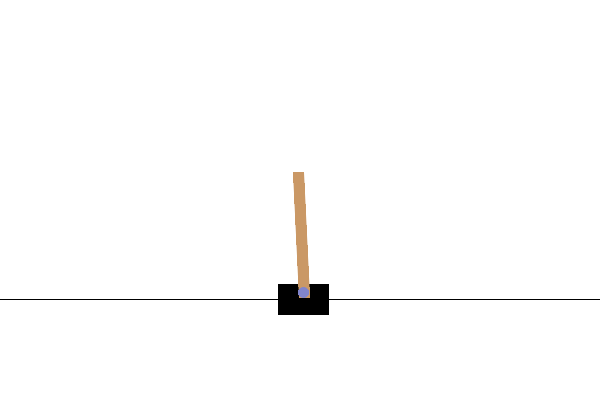

# Get Started with Gymnasium
This doc helps you quickly get started with the Gymnasium (gym) environment we need for this project.

## Compatibility
Gymnasium supports for Python 3.7, 3.8, 3.9, 3.10, 3.11 on Linux and MacOS. Windows is not officially supported, but the community reports that the majority of gym envs works fine with Windows. 

## Installation
To install the base gym library:
```bash
pip install gymnasium
```
Please note that the command above won't install dependencies for all families of gym envs. To install dependency for a specific env family, use
```bash
pip install gynasium[env_family]
```
In our project, use
```bash
pip install gymnasium[classic-control]
```

## Your first gym program
An example is given at ```src/get_started.py```. You can go to the ```src``` directory and simply run this code by
```bash
python get_started.py
```
If you install all of the dependencies correctly, you will see the pygame window as shown below

